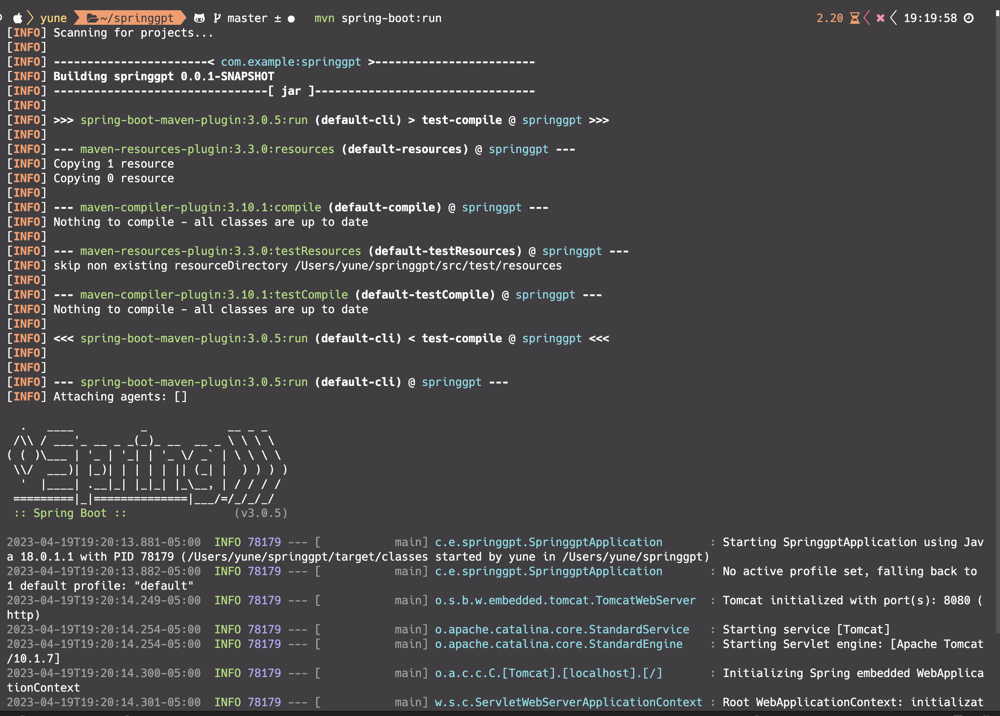
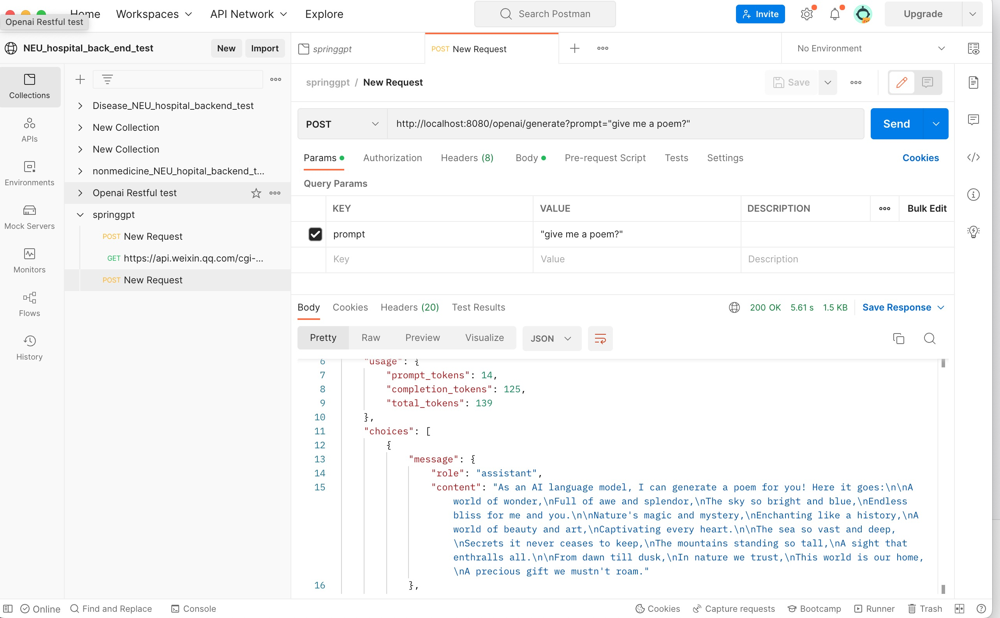
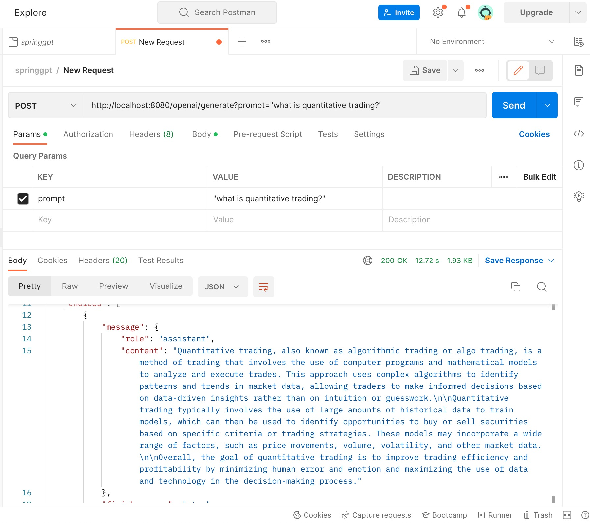

# springgpt

This is a demo springproject for ai tools like gpt, stable diffusion

### use command `mvn spring-boot:run` to run the project

### call the stupid api with postman

### Now we need a front end and a database to show and restore the answer
